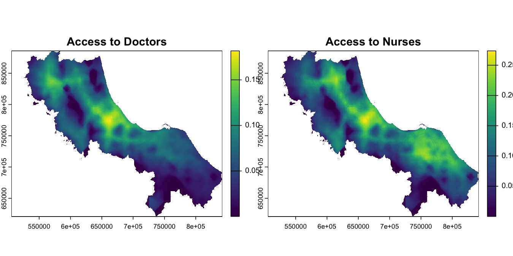

<!-- README.md is generated from README.Rmd. Please edit that file -->

# spax: Spatial Accessibility Analysis in R

<!-- badges: start -->
<!-- badges: end -->

`spax` is an R package designed for advanced spatial accessibility
analysis, focusing on Two-Step Floating Catchment Area (2SFCA) methods
and their derivatives. The package offers a fresh perspective on spatial
accessibility through its raster-based computational approach and
modular design.

## Features

- **Computational Simplicity**: Raster-based operations translate
  complex spatial relationships into simple matrix calculations
- **Modular Design**: Functions work like LEGO bricks - mix and match
  components to build custom analysis workflows
- **Complex Demand Handling**: Support for continuous population
  surfaces, letting you work with high-resolution demand data
- **Monte Carlo Integration**: Built-in tools for uncertainty analysis
  and stochastic demand modeling

## Installation

You can install the development version of spax from
[GitHub](https://github.com/) with:

``` r
# install.packages("pak")
pak::pak("Songyosr/spax")
```

## Example

Here’s how spax’s modular design works in practice, analyzing healthcare
accessibility in Thailand’s Region 12:

``` r
library(spax)
library(terra)
#> terra 1.8.5
library(sf)
#> Linking to GEOS 3.11.0, GDAL 3.5.3, PROJ 9.1.0; sf_use_s2() is TRUE

# Load example data (already included in package)
pop <- rast(u5pd)  # Under-5 population density
hospitals <- hc12_hos  # Hospital locations and capacity
distance <- rast(hos_iscr)  # Travel time to hospitals

# Calculate accessibility using Enhanced 2SFCA
accessibility <- spax_e2sfca(
  demand = pop,  # Population density
  supply = hospitals |> st_drop_geometry(),  # Hospital capacity
  distance = distance,  # Travel times
  decay_params = list(
    method = "gaussian",
    sigma = 30  # 30-minute characteristic distance
  ),
  demand_normalize = "standard",  # Prevent demand inflation
  id_col = "id",
  supply_cols = c("s_doc", "s_nurse")  # Analyze both doctors and nurses
)

# Plot results
plot(accessibility, 
     main = c("Access to Doctors", "Access to Nurses"))
plot(vect(bound0), add = TRUE)
```



This example demonstrates key features of spax:

- Working with continuous population surfaces (demand)

- Handling multiple supply indicators simultaneously

- Gaussian distance decay for more realistic accessibility modeling

## Getting Started

Check out our vignettes for detailed guidance:

1.  [Getting Started with
    spax](https://songyosr.github.io/spax/articles/spax-101-intro.html):
    Learn the basics through a healthcare case study

2.  [Data Preparation
    Guide](https://songyosr.github.io/spax/articles/data-prep.html):
    Understanding trade-offs and practical considerations

## Contributing

Truth is, I’m just getting started with spax. I’d love to have you on
board to help shape the future of spatial accessibility analysis in R.
Please feel free to submit a Pull Request. For major changes, please
open an issue first to discuss what you would like to change.

## License

This project is licensed under the MIT License - see the LICENSE file
for details.
